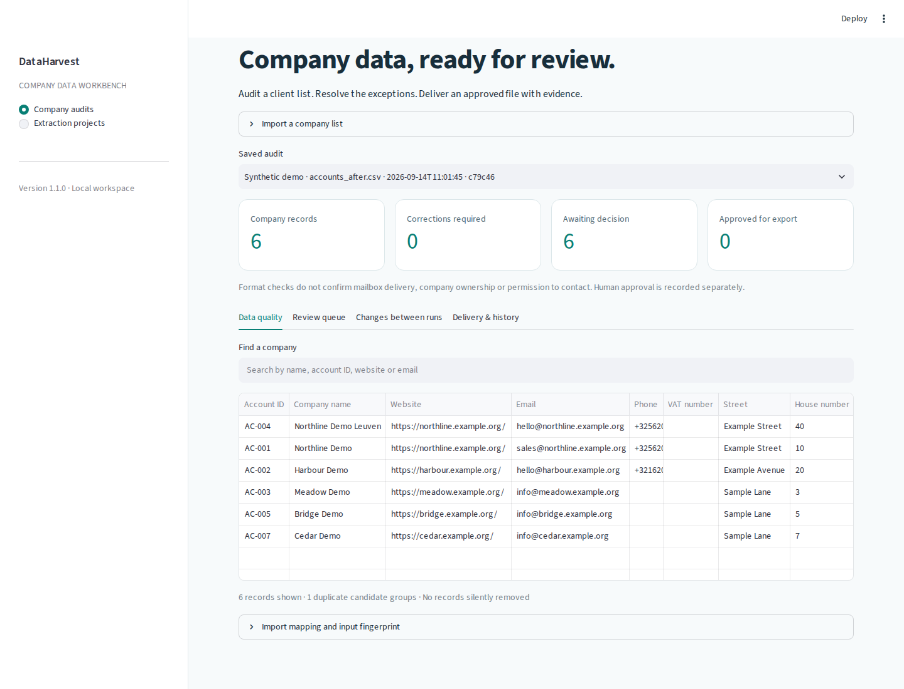

# DataHarvest

**A local company-data audit and review workbench for client delivery.**

Turn a customer-owned CSV or Excel list into an inspectable audit, a saved review queue,
an approved company list, and a comparison against the next revision. An existing extraction
engine also supports website research and structured public sources.

**Status:** version 1.1 is a functional pilot for a trusted local operator. It is not a hosted
multi-tenant service. Commercial demand and customer-specific accuracy still need paid-pilot validation.



## Start on Windows

From an existing checkout, first inspect `git status --short`, then run `git pull --ff-only` when
there are no conflicting local edits. For a new checkout:

```powershell
git clone https://github.com/MahmoudAsadi97/data-extraction_sample1.git
cd data-extraction_sample1
py -m venv .venv
.\.venv\Scripts\Activate.ps1
python -m pip install --upgrade pip
python -m pip install -e ".[ui]"
dataharvest ui
```

On macOS/Linux, use `python3 -m venv .venv` and `source .venv/bin/activate`.
Python 3.10–3.12 are covered by the CI matrix. The dashboard binds to **127.0.0.1:8501**.
Click **Load sample workspace** for a complete offline demonstration with synthetic companies.

For an installation matching the cross-platform dependency lock:

```bash
python -m pip install uv
uv sync --locked --extra dev --extra ui
uv run --no-sync dataharvest ui
```

## The customer workflow

1. **Import** a CSV, TSV or XLSX file. The `accounts` schema requires **Account ID** and **Company name**.
   Use the mapping box if your headers differ, for example `Customer number=account_id`.
2. **Audit** missing fields, invalid values and duplicate candidates. All input records survive the audit.
   The import is offline; no customer list is sent to an enrichment service.
3. **Review** one record at a time. Save an operator name, decision and explanation. Invalid/conflicting
   values or missing required fields must be corrected in the source file and re-imported before approval.
4. **Deliver** an approved-only CSV and a full evidence JSON. Approval does not change automatic
   verification status. Flags require a reviewer note; rejected and pending records stay out of approved exports.
5. **Compare** later runs for the same project using the stable Account ID. Added, removed and changed
   values are explicit. Row reordering is ignored. Missing or duplicate keys stop comparison.

The sample demonstrates **one addition, one removal, three changed accounts and two unchanged accounts**.
It intentionally includes invalid input and separate company branches. It is not a real prospect list.

## What is included

| Capability | Behavior |
|---|---|
| Durable history | SQLite snapshots, input SHA-256, schemas, normalized fields, source evidence and warnings |
| Review trail | Pending / approved / rejected, reviewer notes, timestamps, revision checking to prevent lost updates |
| Conservative matching | Conflicting locations and legal identifiers are flagged; shared chain domains alone do not cause merging |
| Explicit validation | Duplicate headers, ambiguous mappings, malformed rows and formula-bearing workbook cells are rejected |
| Safe delivery | Formula-like CSV text is escaped; JSON keeps exact normalized values and original candidates |
| Bounded local imports | 5,000 rows, 200 columns, 20 MiB compressed input, 100 MiB expanded workbook; clear errors at limits |
| Extraction engine | OpenStreetMap, Wikidata, CSS listing extraction, seed files, optional Places/Apollo integrations |
| Website controls | Public HTTP(S) destinations, redirect checks, matching robots rules, response-size limits and retries |
| Packaging | Installable CLI and dashboard, included demo assets, universal dependency lock and CI |

The comparison budget is 250,000 candidate pairs. Highly repetitive lists may reach it below 5,000
rows. Collection then fails explicitly; duplicate checks are never silently skipped. Split such inputs
by a stable, disjoint business scope and review potential duplicates across batches separately.

## Command line

```bash
# No network or credentials required
 dataharvest workspace demo
 dataharvest workspace audit client_accounts.csv --project "Client A" --schema accounts
 dataharvest workspace runs
 dataharvest workspace show RUN_ID
 dataharvest workspace review RUN_ID ROW-0004 approved --reviewer "Operator"
 dataharvest workspace compare BEFORE_RUN_ID AFTER_RUN_ID
 dataharvest workspace export RUN_ID --out approved_accounts.csv
```

All workspace commands accept `--db PATH`. Updating a previous decision requires `--revision N`,
using the revision shown by `workspace show`. Exports refuse to overwrite an existing file.
The UI also supports deleting a saved audit and its review history.

```bash
# Existing extraction and spreadsheet tools
 dataharvest projects
 dataharvest sources
 dataharvest schemas accounts
 dataharvest validate client_list.xlsx --schema leads --optional category --out audit.xlsx
 dataharvest run projects/books_catalogue.yaml --limit 3
 dataharvest run projects/seed_list_enrichment.yaml --limit 10 --no-cache
```

Extraction produces Excel, CSV, JSON and run reports. Timestamped output names are unique per run.
`run --offline` preserves the legacy meaning: it skips enrichment and network verification; configured
web extraction sources still require the network. Use `workspace audit` for a fully offline operation.
Review controls apply to workspace delivery; extraction exports remain research outputs requiring review.

## Repository layout

| Path | Purpose |
|---|---|
| `src/dataharvest/` | Installable application, CLI, dashboard, models and processing |
| `src/dataharvest/schemas/` | Account, lead, company and product schemas |
| `src/dataharvest/examples/` | Small synthetic demo inputs included in the wheel |
| `projects/` | Example extraction configurations |
| `tests/` | Regression, fixture integration, workspace and dashboard tests |
| `docs/` | Product strategy, architecture, operations and validation evidence |
| `scripts/` | Developer checks and demo launchers |
| `data/input/` | Operator input files; only the existing example seed is tracked |
| `data/output/`, `data/cache/`, `data/workspace/` | Generated local files; ignored by Git |
| `uv.lock` | Reproducible dependency resolution across supported Python versions |

Generated workbooks, customer CSVs, caches, databases, credentials and virtual environments are
excluded. Use `python scripts/check_repository.py` before pushing. The installed wheel contains
application code, schemas, synthetic demos and the license; it does not need this checkout to launch.

## Verification and limits

Run `uv run --no-sync pytest -m "not network" --cov=dataharvest` and
`uv run --no-sync ruff check src tests app scripts`. See [validation evidence](docs/VALIDATION.md)
for the release checks and live-network limitations. A green test suite cannot establish zero defects
or production accuracy on unseen customer data.

- Offline auditing checks structure and consistency, not whether a business, mailbox or phone is live.
- Website name matching is a heuristic. A match is supporting evidence, not proof of ownership.
- A valid VAT registration does not establish supplier trust or permission to use the data.
- The database uses local filesystem permissions. Reviewer names are entered by the operator, not
  authenticated identities. Use separate databases and OS access controls for different customers.
- The URL guard reduces private-network request risks; deploy outbound network restrictions before
  running untrusted collection workloads. DNS rebinding and proxy resolution need network enforcement.
- Source-specific storage, attribution and resale conditions apply. See [source guidance](docs/SOURCES_AND_ALTERNATIVES.md).

## Product direction

Start with an assisted **company-list cleanup and recurring maintenance service** for a narrow customer
segment. Sell reviewed exceptions and traceable delivery. Native CRM synchronization, scheduled workers,
authenticated teams, billing and contractual service levels are future work, not current features.

[Commercial plan](docs/PRODUCT_STRATEGY.md) · [Architecture](docs/ARCHITECTURE.md) ·
[Operating guide](docs/OPERATIONS.md) · [Change log](CHANGELOG.md)

Maintainer: **Mahmoud Asadi Heris** · [MahmoudAsadi97](https://github.com/MahmoudAsadi97)

MIT licensed. Existing third-party dataset and dependency licenses still apply.
