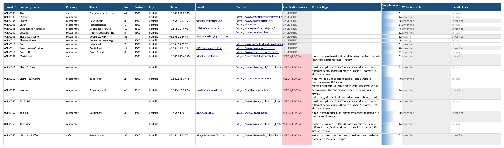
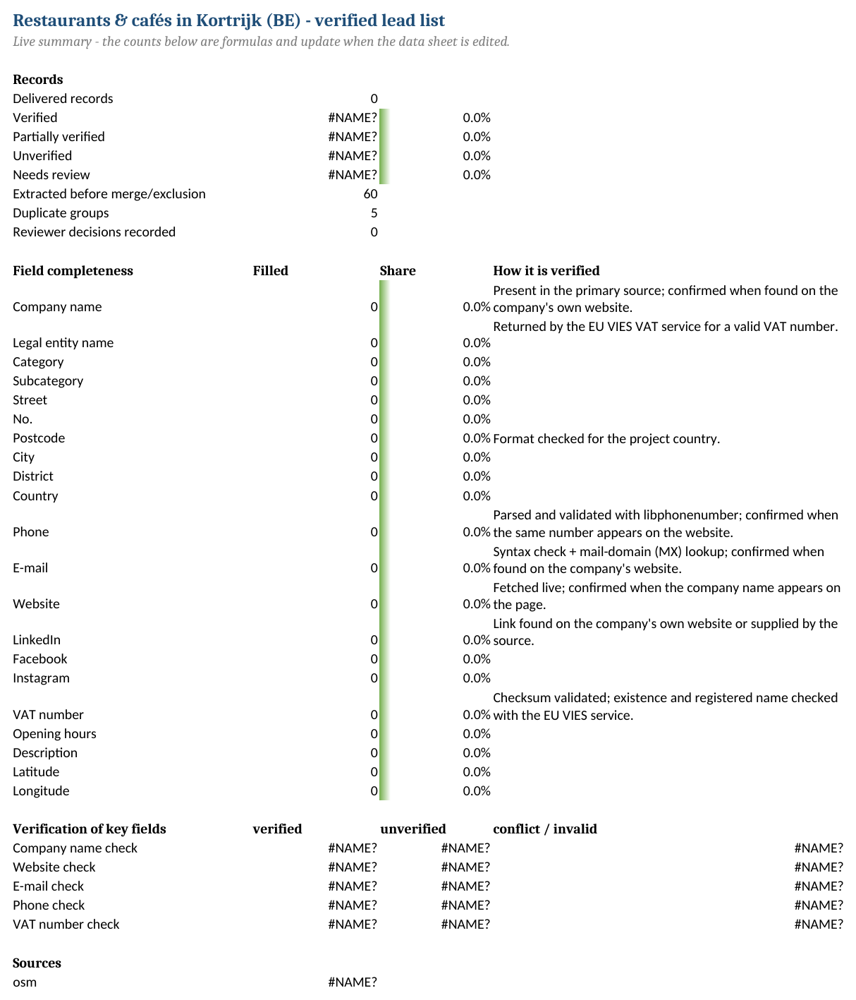

# DataHarvest - web data extraction, verification & spreadsheet delivery

[](https://github.com/MahmoudAsadi97/data-extraction_sample1/actions/workflows/ci.yml)


A complete, runnable data-extraction workflow: collect records from websites and online databases,
normalise them into one consistent structure, **verify every contact detail**, detect duplicates,
and deliver a reviewer-friendly **Excel workbook / CSV / Google Sheet** with a quality report.

Built for lead-generation and data-entry projects where the brief says *"verify before adding it to the
database, and flag what you cannot verify instead of guessing"*.

<p align="center">
  
</p>

## What it does

| Step | What happens | Where |
|---|---|---|
| **Extract** | Pull records from one or more sources: OpenStreetMap (Overpass), Wikidata (SPARQL), any listing website (CSS selectors + pagination + detail pages), CSV/Excel seed lists, Google Maps Places API, Apollo.io | `src/dataharvest/sources/` |
| **Normalise** | One format per field type: E.164 phones, lower-case e-mails, canonical URLs, postcodes, VAT numbers, social profile URLs | `processing/normalize.py` |
| **Enrich** | Visit each company website (home + contact pages): find e-mails, phones, LinkedIn/Facebook/Instagram, VAT numbers, description; web-search for missing websites; Apollo firmographics (optional) | `enrich/` |
| **Verify** | Website liveness + name match, mail-domain (MX) lookup, phone validity, VAT checksum + **EU VIES register**, cross-source agreement | `enrich/vies.py`, `processing/verify.py` |
| **Validate** | Required fields, formats, ranges, consistency rules (e-mail vs website domain, closed businesses, dissolved companies) | `processing/validate.py` |
| **Dedupe** | Blocking + fuzzy matching on names and hard identifiers; confident duplicates merged, doubtful ones flagged | `processing/dedupe.py` |
| **Deliver** | Excel workbook (6 sheets, live formulas, colour-coded statuses, reviewer columns), CSV (UTF-8 BOM), JSON with full provenance, optional Google Sheets, run report | `export/` |
| **Audit** | `dataharvest validate file.xlsx` checks *any* existing spreadsheet for missing, invalid and duplicate records | `qa.py` |

Every value keeps its **provenance** (which source, which page) and a **status**: `verified`, `unverified`,
`conflict`, `invalid` or `missing`. Nothing is guessed: a value that could not be confirmed stays
`unverified`, sources that disagree produce a `conflict`, and the record lands in the **Needs Review** sheet.

## Quick start

Requires Python 3.10+ and an internet connection. No API keys are needed for the default projects.

**Windows (PowerShell)**

```powershell
git clone https://github.com/MahmoudAsadi97/data-extraction_sample1.git
cd data-extraction_sample1
py -m venv .venv
.\.venv\Scripts\Activate.ps1
pip install -e ".[dev,ui]"
dataharvest run projects/kortrijk_restaurants.yaml --limit 30    # 1-2 minutes
```

**macOS / Linux**

```bash
git clone https://github.com/MahmoudAsadi97/data-extraction_sample1.git
cd data-extraction_sample1
python3 -m venv .venv && source .venv/bin/activate
pip install -e ".[dev,ui]"
dataharvest run projects/kortrijk_restaurants.yaml --limit 30
```

Or simply `scripts\demo.ps1` / `scripts/demo.sh`, which sets everything up and runs the demo projects.
(`pip install -e .` is enough for the command line; `[dev]` adds the test tools, `[ui]` the dashboard,
`[gsheets]` the Google Sheets export.)

The run prints a progress bar per stage and a result table, then writes to `data/output/`:

```
kortrijk_restaurants_2026-09-08.xlsx         Excel workbook (Summary, Leads, Needs Review, Duplicates, Run Log, Data Dictionary)
kortrijk_restaurants_2026-09-08.csv          same rows, UTF-8 with BOM (opens correctly in Excel and Google Sheets)
kortrijk_restaurants_2026-09-08.json         every record with per-field source, status, notes and raw payload
kortrijk_restaurants_2026-09-08_report.md    human-readable run report (+ .json)
```

Drop `--limit` to collect everything (about 150 businesses for the Kortrijk project, 3-6 minutes).
Pages are cached for 7 days in `data/cache/`, so re-runs are fast; use `--no-cache` to refresh.

## Example projects

| Project file | Task | Sources | Keys needed |
|---|---|---|---|
| `projects/kortrijk_restaurants.yaml` | Verified lead list of all restaurants & cafés in Kortrijk (BE) | OpenStreetMap + company websites + web search + VIES | none |
| `projects/kortrijk_b2b_offices.yaml` | B2B prospect list: IT, software, consulting & marketing offices | OpenStreetMap (+ Google Maps / Apollo when keys are set) | none |
| `projects/west_flanders_companies.yaml` | Company register: companies headquartered in West Flanders | Wikidata + websites + VIES | none |
| `projects/seed_list_enrichment.yaml` | Complete, verify and de-duplicate a client-supplied list (the LinkedIn / manual-research workflow) | CSV seed list + websites + web search + VIES | none |
| `projects/books_catalogue.yaml` | Product catalogue from a paginated listing site with detail pages | `html_list` on books.toscrape.com (scraping sandbox) | none |

```bash
dataharvest projects                          # list project files
dataharvest run west_flanders_companies       # by name
dataharvest run projects/books_catalogue.yaml
dataharvest validate data/input/seed_companies.csv --schema leads --country BE   # audit an existing file
dataharvest sources                           # which sources are ready / which need API keys
dataharvest schemas leads                     # fields of a schema
dataharvest init bakeries --template leads    # scaffold a new project
dataharvest ui                                # browser dashboard (Streamlit)
```

## The Excel deliverable

<p align="center">
  
</p>

| Sheet | Content |
|---|---|
| **Summary** | Live formulas: delivered records, status breakdown, field completeness, verification per key field, sources, status legend |
| **Leads** (data) | One row per record: schema fields, `Verification status`, `Review flags`, `Completeness %`, one `… check` column per key field (status + reason + other values seen), source, source URL, duplicate group, timestamp, **Reviewer decision** (drop-down) and **Reviewer notes** |
| **Needs Review** | Only the records that need a human decision, with the reason, the checks and resolution columns |
| **Duplicates** | Merged groups and *possible* duplicates (branches/chains) with the reason and similarity |
| **Run Log** | Project, sources, settings, stage timings, warnings |
| **Data Dictionary** | Every column: type, required, description, how it is verified |

Headers are frozen and filterable, URLs and e-mails are clickable, statuses are colour-coded
(green verified · blue partially verified · grey unverified · red needs review), phone numbers are
formatted consistently (`+32 56 20 55 88`), and the summary formulas keep working while reviewers edit.

## How verification works

| Field | Checks | Becomes `verified` when |
|---|---|---|
| Company name | present in source | found on the company's own website, or matches the VAT-register name |
| Website | fetched live (status, redirects, HTML), robots.txt respected | live **and** the company name appears on the page |
| E-mail | syntax, mail-domain MX/A lookup (DNS, DNS-over-HTTPS fallback) | listed on the company's website (or same value in two sources) |
| Phone | libphonenumber validation for the project country | same number found on the website |
| VAT number | format + modulo-97 checksum (BE), **EU VIES** lookup -> registered legal name & address | VIES says valid (legal name recorded in `Legal entity name`) |
| Social profiles | canonical profile URLs; share/agency links filtered | linked from the company website |
| Address | postcode format, city presence | (cross-checked against the VIES address when available) |

Record status: **VERIFIED** (required fields present, ≥2 contact fields confirmed or name + 1),
**PARTIALLY_VERIFIED** (≥1 confirmed), **UNVERIFIED** (well-formed, single source),
**NEEDS_REVIEW** (a check failed, sources disagree, required field missing, suspected duplicate),
**EXCLUDED** (unusable, e.g. nameless - kept in the review sheet and JSON for audit, never silently dropped).

## Sources and the "preferred tools" mapping

| Tool in the brief | Implementation | Notes |
|---|---|---|
| Google Maps | `google_places` (Places API New) **or** `osm_overpass` (OpenStreetMap, free) | Same fields: name, address, phone, website, coordinates, opening hours |
| Google Search | `google_cse` provider (Programmable Search, 100 free queries/day) **or** DuckDuckGo (no key) | Only used to *find* a website; the site is then verified before it is trusted |
| LinkedIn | `csv_import` for Sales Navigator / manual exports + LinkedIn company URLs extracted from websites, Wikidata and Apollo | LinkedIn itself is not scraped (terms of use) |
| Apollo | `apollo` source (company search) + enrichment by domain | Needs `APOLLO_API_KEY` |
| Excel / Google Sheets | `openpyxl` workbook, CSV, `gspread` push (`--gsheets`) | See `docs/GOOGLE_SHEETS_SETUP.md` |

All optional keys go in `.env` (copy `.env.example`). Everything runs without them.
Details, limits and the legal/ethical rules followed (robots.txt, rate limits, business data only) are in
[`docs/SOURCES_AND_ALTERNATIVES.md`](docs/SOURCES_AND_ALTERNATIVES.md).

## Project configuration

A project is one YAML file - the client brief in machine-readable form:

```yaml
project:
  name: kortrijk_restaurants
  title: "Restaurants & cafés in Kortrijk (BE) - verified lead list"
  country: BE                      # phone / postcode / VAT rules
  instructions: |                  # the brief, kept with the output
    Collect all restaurants and cafés in Kortrijk ...
schema: leads                      # built-in: leads | companies | products, or your own fields
sources:
  - type: osm_overpass
    area: Kortrijk
    tags: [amenity=restaurant, amenity=cafe]
enrichment:
  website: {enabled: true, max_pages_per_site: 3, workers: 6}
  find_missing_websites: {enabled: true, provider: auto, max_queries: 40}
  vies: {enabled: true}
verification: {website_liveness: true, email_mx: true, phone_format: true}
dedupe: {enabled: true, name_similarity: 90, merge: true}
output:
  directory: data/output
  formats: [xlsx, csv, json]
  google_sheets: {enabled: false, title: "Kortrijk restaurants"}
```

Schemas define the columns and their validation (`src/dataharvest/schemas/*.yaml`); a project can also
declare its own `fields:` inline, or adjust a built-in one with `schema_overrides:` (for example
`category: {required: false}` when a client list has no category column). Field types drive the checks: `email`, `url`, `phone`, `postcode`,
`vat`, `social`, `number`, `integer`, `year`, `date`, `enum`, `latitude`, `longitude`, `string`, `text`.

## Auditing an existing spreadsheet

```bash
dataharvest validate client_list.xlsx --schema leads --country BE -m "Tel=phone" --optional category
```

Maps the columns automatically (labels, field names and common aliases such as *Company*, *Tel*, *E-mail*),
normalises the values, applies every format rule, flags missing required fields, finds duplicates and
writes `client_list_audit.xlsx` in the same workbook layout - with every problem in the `Review flags`
column and a Needs Review sheet.

## Dashboard

`dataharvest ui` opens a Streamlit page: choose a project, toggle enrichment steps, run with a progress
bar, filter/search the result, inspect review flags and duplicates, and download the files.

<p align="center">
  
</p>

## Testing

```bash
pytest                       # 100+ tests, no network needed (recorded API responses in tests/fixtures)
pytest --cov=dataharvest     # coverage
ruff check src tests         # lint
```

The fixtures are real responses captured from Overpass, Nominatim, Wikidata, VIES and DuckDuckGo, so the
parsers are tested against the actual formats those services return. CI runs the suite on Python 3.10-3.12
on every push.

## Repository layout

```
projects/                 runnable project files (one per client task)
src/dataharvest/
  sources/                osm_overpass, wikidata, html_list, csv_import, google_places, apollo (+ nominatim helper)
  enrich/                 website crawler, web search, VIES
  processing/             normalize, validate, verify, dedupe
  export/                 excel, csv/json, google sheets
  schemas/                leads.yaml, companies.yaml, products.yaml
  pipeline.py cli.py qa.py report.py config.py models.py http.py
app/streamlit_app.py      dashboard
data/input/               seed lists       data/output/  results (+ samples/)      data/cache/  HTTP cache
docs/                     brief, SOP, QA checklist, data dictionary, sources, traceability, Google Sheets setup
tests/                    pytest suite + recorded fixtures
```

## Documentation

- [`docs/PROJECT_BRIEF.md`](docs/PROJECT_BRIEF.md) - the example client brief the sample projects implement
- [`docs/SOP.md`](docs/SOP.md) - step-by-step operating procedure for a data-extraction job
- [`docs/QA_CHECKLIST.md`](docs/QA_CHECKLIST.md) - quality gates before delivery
- [`docs/DATA_DICTIONARY.md`](docs/DATA_DICTIONARY.md) - every column and status explained
- [`docs/SOURCES_AND_ALTERNATIVES.md`](docs/SOURCES_AND_ALTERNATIVES.md) - sources, limits, alternatives, ethics
- [`docs/REQUIREMENTS_TRACEABILITY.md`](docs/REQUIREMENTS_TRACEABILITY.md) - brief requirement -> implementation -> test
- [`docs/ARCHITECTURE.md`](docs/ARCHITECTURE.md) - modules and data flow
- [`docs/GOOGLE_SHEETS_SETUP.md`](docs/GOOGLE_SHEETS_SETUP.md) - service-account setup for the Sheets export

## Troubleshooting

**"Temporary failure in name resolution" / every website flagged as unreachable (WSL, VPN).**
Extraction works but the website checks fail while `nslookup hollywok.be` also fails in the same shell:
the machine's DNS resolver is broken, not the websites. The tool detects this, leaves those websites
`unverified` with a note instead of marking them dead, and prints a warning. WSL2's DNS forwarder is the
usual culprit (it drops parallel lookups); point WSL at a public resolver once:

```bash
sudo tee /etc/wsl.conf >/dev/null <<'EOF'
[network]
generateResolvConf = false
EOF
sudo rm -f /etc/resolv.conf
printf 'nameserver 1.1.1.1\nnameserver 8.8.8.8\n' | sudo tee /etc/resolv.conf >/dev/null
```

then run `wsl --shutdown` from PowerShell, reopen the shell and re-run. Alternatives: run the project from
Windows PowerShell instead of WSL, or lower `enrichment.website.workers` to 2 in the project file.
Failed checks are never cached, so a re-run simply repeats them.

**Rate-limited web search.** DuckDuckGo answers 202/403 after a burst of queries; the run continues and the
report says how many searches ran. Add `GOOGLE_CSE_API_KEY` / `GOOGLE_CSE_ID` to `.env` for a stable quota.

**The Excel file is open.** The workbook is written under a timestamped name and a warning is shown;
CSV/JSON are always written first.

**Slow HTTP cache on `/mnt/c` (WSL).** Set `http: {cache: false}` in the project file or run from the
Linux file system.

## Limitations

- Web search without a Google key uses DuckDuckGo's HTML endpoint, which rate-limits aggressively; the
  tool backs off and reports how many searches ran. Set `GOOGLE_CSE_API_KEY`/`GOOGLE_CSE_ID` for reliable search.
- VIES returns registered names for most member states but not all; address parsing is best-effort.
- Website enrichment reads static HTML only (no JavaScript rendering); sites that render everything
  client-side yield fewer contact details and are marked accordingly, never guessed.
- OpenStreetMap coverage varies by area; use `google_places` where completeness matters and a key is available.

## License

MIT - see [LICENSE](LICENSE).
