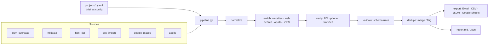

# Architecture

## Modules

| Module | Responsibility |
|---|---|
| `config.py` | Pydantic models for the project file (`ProjectConfig`), `.env` loading, path resolution |
| `schema.py` | Field definitions (`FieldDef`, `Schema`), built-in schemas in `schemas/*.yaml` |
| `models.py` | `Record` with per-field `FieldValue` (value, source, status, note, candidates), `RawRecord`, `DuplicateGroup`, status enums |
| `http.py` | `HttpClient`: retries, per-host delay, robots.txt, sqlite cache (`requests-cache`), size-limited `fetch()` that never raises |
| `sources/` | `BaseSource` + registry; one module per source; `nominatim.py` resolves place names to Overpass areas |
| `enrich/website.py` | Fetch home + contact pages, extract e-mails/phones/socials/VAT/description, name match |
| `enrich/search.py` | `WebSearch` (Google CSE / DuckDuckGo), directory filtering, best-candidate scoring |
| `enrich/vies.py` | VIES REST client with transient-error retries and caching |
| `processing/normalize.py` | Canonical formats; pure functions, no network |
| `processing/validate.py` | Schema rules + cross-field checks |
| `processing/verify.py` | Mail-domain checker (DNS + DoH), phone check, record status and completeness |
| `processing/dedupe.py` | Blocking, pairwise comparison, union-find clustering, merge policy |
| `pipeline.py` | Orchestrates the stages, applies enrichment results to records, progress callbacks, output paths |
| `report.py` | `RunReport`: stages, counts, completeness, flags -> Markdown/JSON, and the Run Log sheet |
| `export/` | `columns.py` (shared layout), `excel.py`, `flat.py` (CSV/JSON), `gsheets.py` |
| `qa.py` | Audit of existing spreadsheets (map columns -> normalise -> validate -> dedupe, flag only) |
| `cli.py` | Typer commands: run, validate, sources, schemas, projects, init, gsheets, ui |
| `app/streamlit_app.py` | Dashboard on top of `Pipeline` |

## Design choices

- **Provenance first.** Every value carries where it came from and why it is trusted, so the spreadsheet
  can explain itself and a reviewer can resolve conflicts without re-researching.
- **Never guess.** Enrichment may *add* values, but a value found by search or on a page is only
  `verified` when an independent signal confirms it (name on page, VIES answer, second source).
- **Fail soft.** A dead website, a rate-limited search or an unavailable service becomes a status and a
  warning in the report - it never aborts the run or drops the record.
- **Config over code.** New tasks are new YAML files: sources, tags, selectors, thresholds, outputs.
  New websites need selectors, not code (`html_list`).
- **Testable offline.** All network calls go through `HttpClient`, so the suite mocks them with recorded
  responses and runs in seconds without internet.
- **Cross-platform.** Pure Python, UTF-8 everywhere, no shell dependencies; tested on Windows paths via
  `pathlib`.

## Adding a source

1. Create `src/dataharvest/sources/my_source.py` with a class deriving from `BaseSource`, set `type`,
   `description`, `requires_env` and implement `extract()` yielding `RawRecord`s whose `values` use
   schema field names.
2. Decorate it with `@register` and add the import to `sources/base.py::_ensure_loaded`.
3. Add a fixture and a test in `tests/test_sources.py`.
